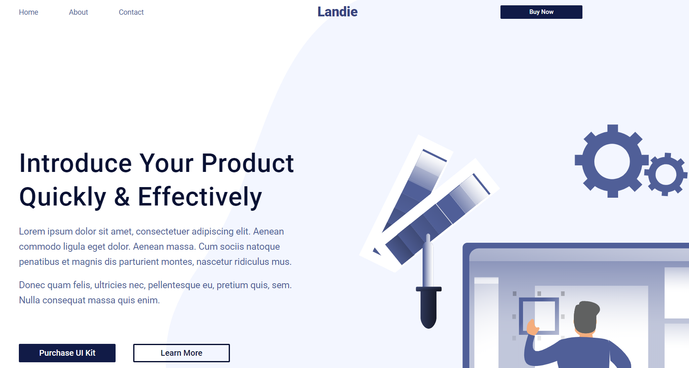

# Landing Website For Live Coding sessions
Simple landing page made with pure HTML/CSS/JS for students of ["Internet of Things"](http://iot.lviv.ua) programm in Lviv Polytechnic National University.
The website was made by students of [the same program](http://iot.lviv.ua), who decided to contribute into education and to inspire young generation 



---
## Design
[Click to view in Figma](https://www.figma.com/file/j4Cj7lPDyhHJbg54tCw4Zc/1st-coding-task?node-id=2172%3A760)

## Installation
You could just download the project and open **index.html** file and you are all set!<br>
<br>
However if you want to have a greater development experience, I **strongly recommend** you to do the following:
1. Dowload and install Node from [official Node.js website](https://nodejs.org/)
2. Install the **npx** util by running the following command:
```
$ npm i -g npx
```
Now, you can go to the root of your project and launch the project with command:
```
$ npm start
```
